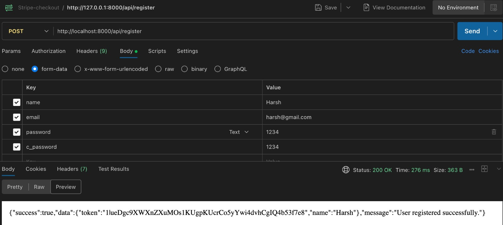
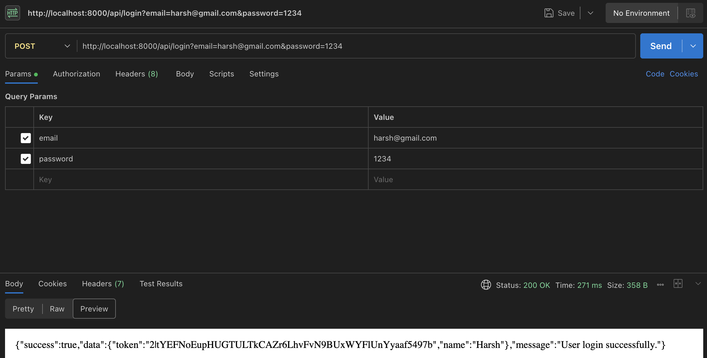
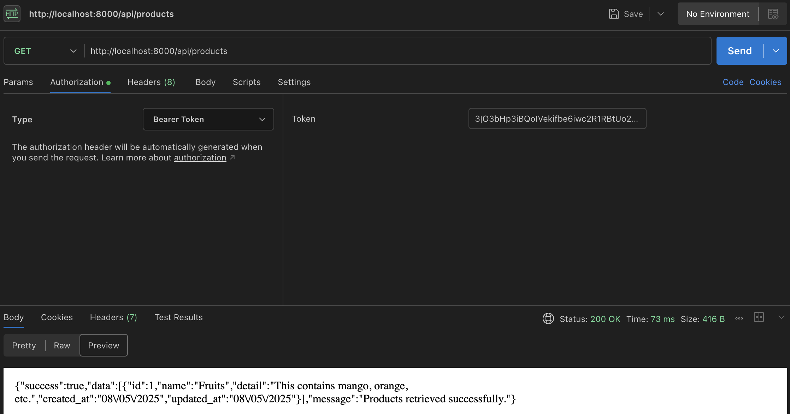
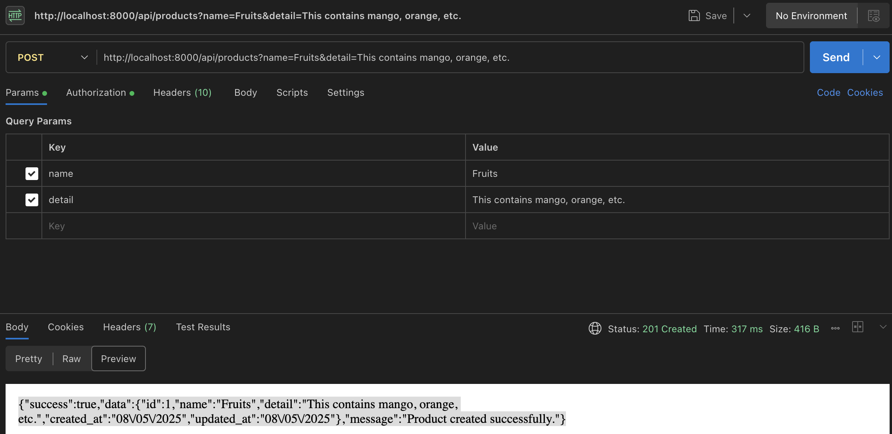
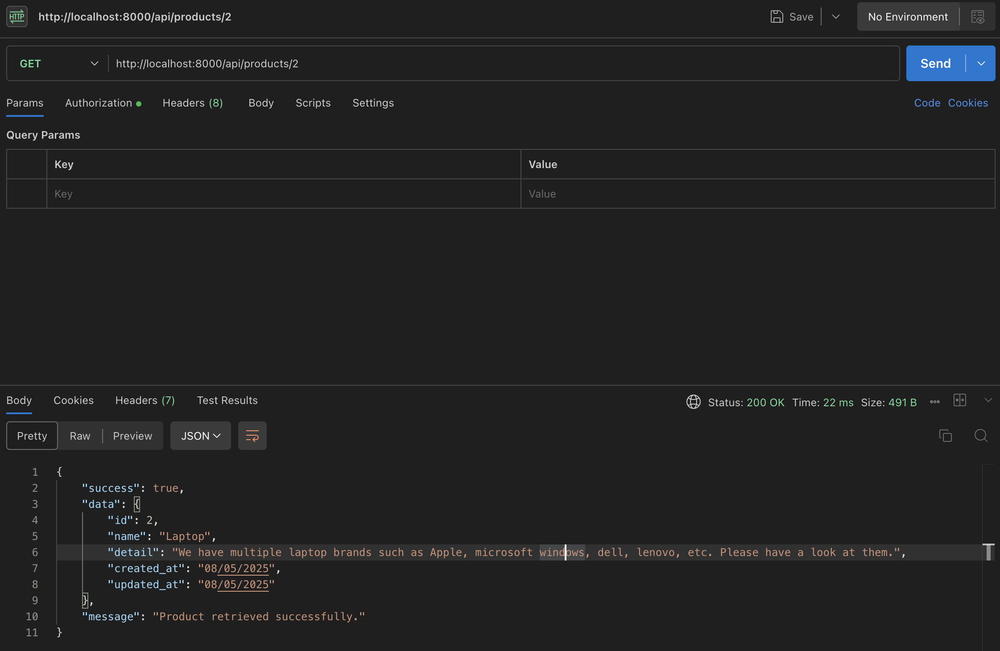
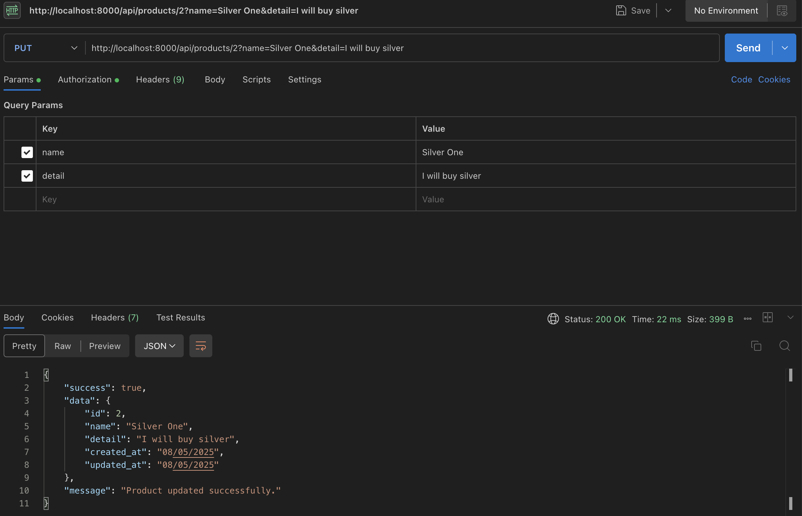
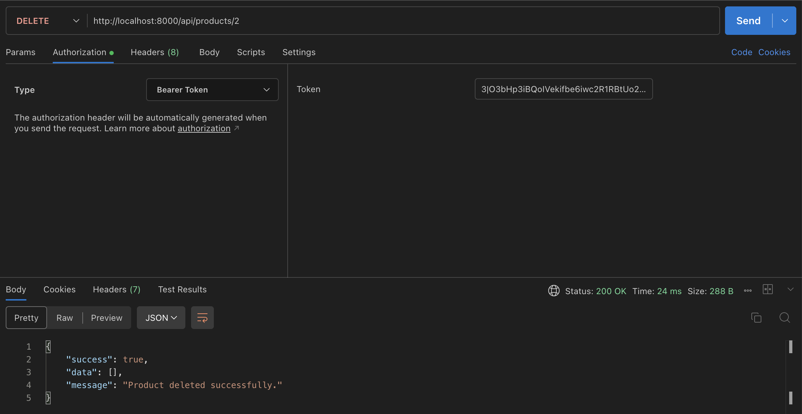
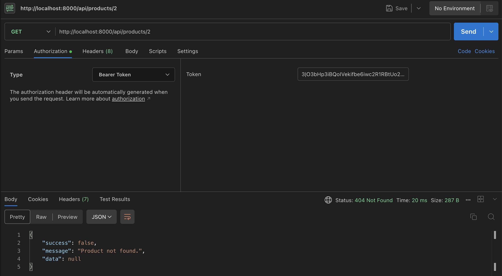

## About Laravel

Laravel is a web application framework with expressive, elegant syntax. We believe development must be an enjoyable and creative experience to be truly fulfilling. Laravel takes the pain out of development by easing common tasks used in many web projects, such as:

- [Simple, fast routing engine](https://laravel.com/docs/routing).
- [Powerful dependency injection container](https://laravel.com/docs/container).
- Multiple back-ends for [session](https://laravel.com/docs/session) and [cache](https://laravel.com/docs/cache) storage.
- Expressive, intuitive [database ORM](https://laravel.com/docs/eloquent).
- Database agnostic [schema migrations](https://laravel.com/docs/migrations).
- [Robust background job processing](https://laravel.com/docs/queues).
- [Real-time event broadcasting](https://laravel.com/docs/broadcasting).

Laravel is accessible, powerful, and provides tools required for large, robust applications.

## What is Laravel Sanctum?
Laravel Sanctum is an API authentication package for Laravel applications, providing a lightweight, simple-to-use authentication system for single-page applications (SPAs), mobile apps, and other API-driven projects. It offers token-based authentication using JSON Web Tokens (JWT) or API tokens, enabling secure authentication without the overhead of traditional session-based authentication. Sanctum simplifies setting up token authentication, allowing developers to focus on building their applications rather than dealing with authentication complexities.

We will use Laravel Sanctum, an authentication system package for developing simple APIs for SPAs (single-page applications) which are commonly built via React JS, Angular, or Vue JS.

In this example, we will install the Laravel 11 application. Then, we will install the Sanctum composer package for API authentication. After that, we will create register and login APIs for user authentication. Then, we will create a products REST API, and you must authenticate using a user token. So, let's follow the steps below to complete this example step by step:

## Postman API 
Here are the Routes URLs with Verbs:

1. Register API: Verb:GET, URL:http://localhost:8000/api/register

2. Login API: Verb:GET, URL:http://localhost:8000/api/login

3. Product List API: Verb:GET, URL:http://localhost:8000/api/products

4. Product Create API: Verb:POST, URL:http://localhost:8000/api/products

5. Product Show API: Verb:GET, URL:http://localhost:8000/api/products/{id}

6. Product Update API: Verb:PUT, URL:http://localhost:8000/api/products/{id}

7. Product Delete API: Verb:DELETE, URL:http://localhost:8000/api/products/{id}

You can also if product is present or not by using GET request:

